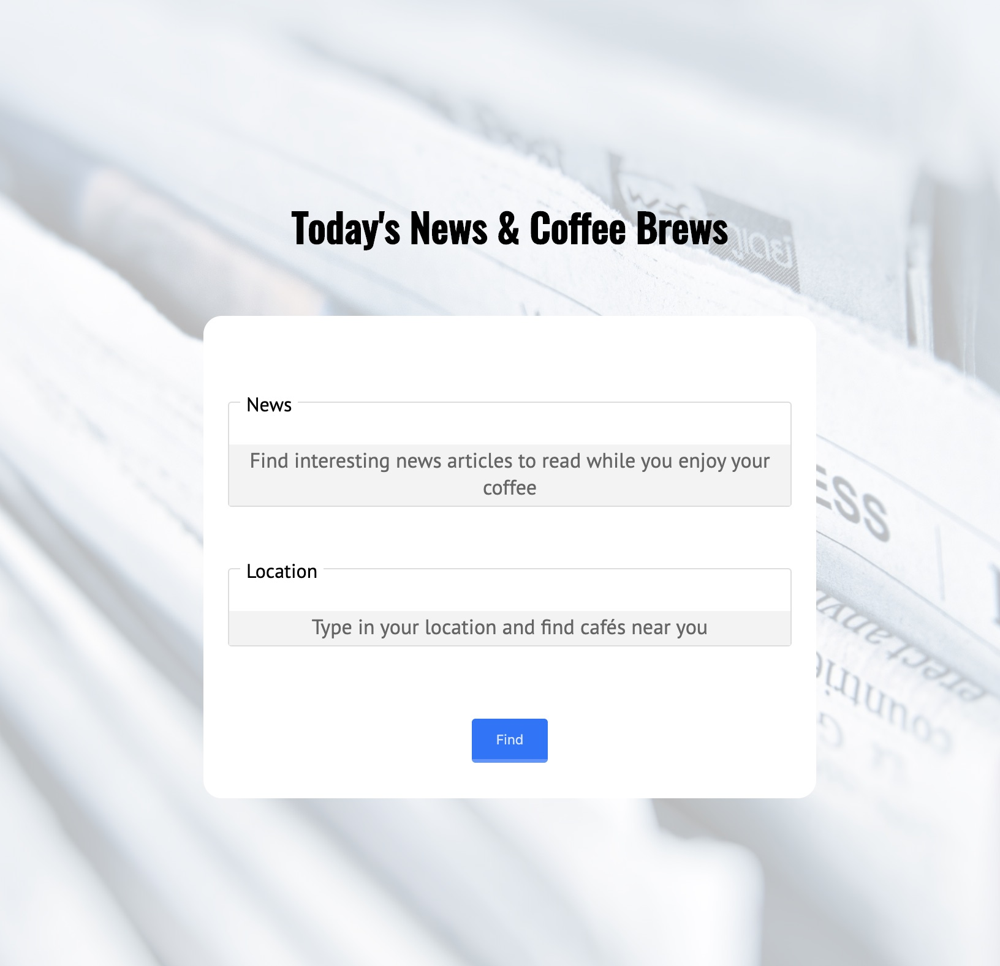
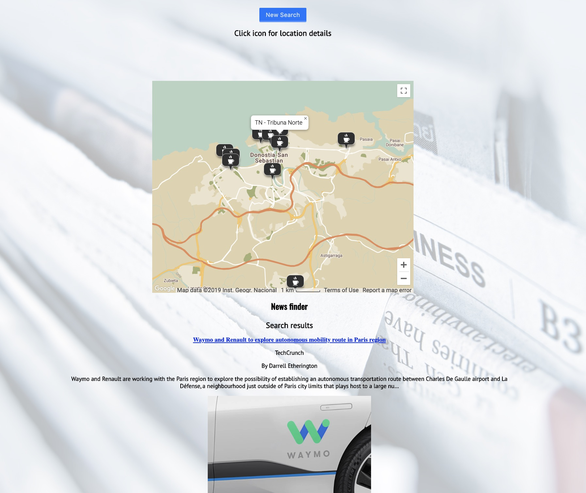
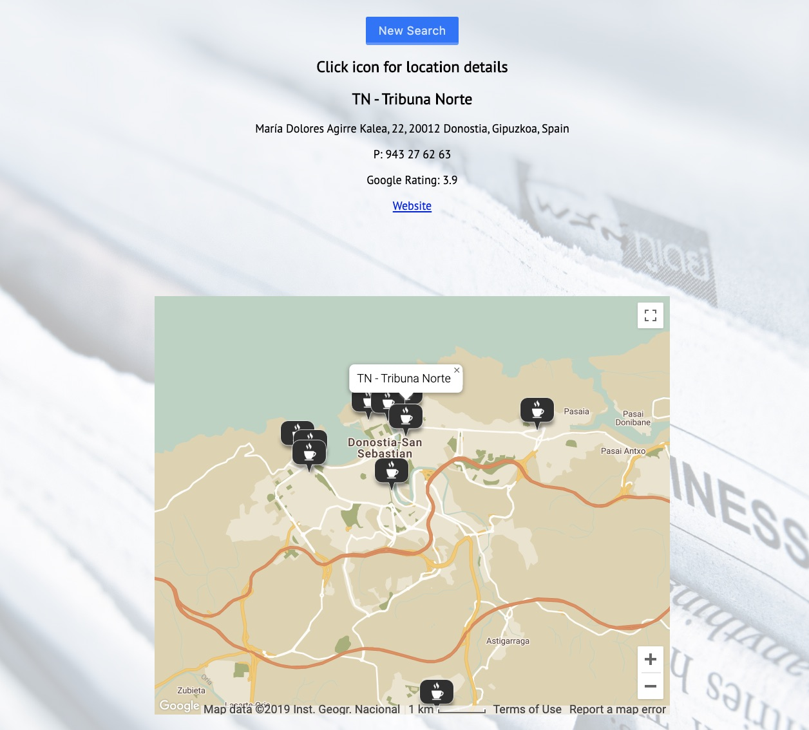

<h1>API Captsone Project</h1>

<h2>Technologies Used</h2>
<h3>jQery | HTML | CSS</h3>

<h2>Description</h2>

Using the Google Maps API and the News API, I created an app that allows you to find coffee shops in your area along with the types of news articles that you want to read while you are at your coffee shop. Whithin the app you are able to click on map icons to find out more information about these coffee shops.

Morning coffee and the latest news are two things that I am deeply passionate about. This simple app keeps me updated and helps me find the best place for a nice cup of joe.

<h2>Homepage</h2>

<h2>Post Search</h2>

<h2>Cafe Info</h2>

<h2>Link</h2>

Check out the live version<a href="https://krusecodes.github.io/api_hack_capstone/"> HERE</a>.
